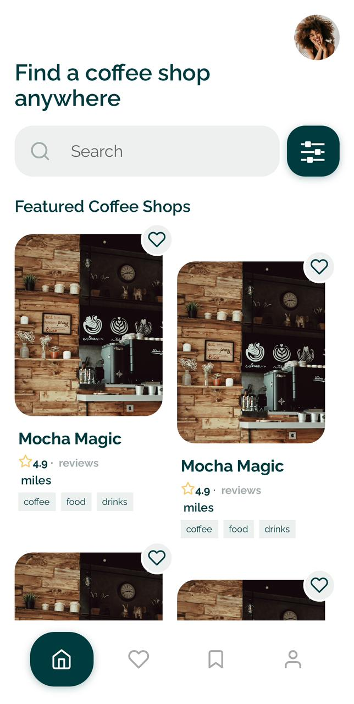

# Coffee Finder App

## Overview
The Coffee Finder App helps users discover nearby coffee shops, explore their details, and view available products. It utilizes React Native for the frontend, integrating with a Node.js backend API for fetching coffee shop data.

## Features
- View detailed information about coffee shops, including ratings and reviews.
- Explore different categories of products offered by each coffee shop.
- Navigate to the coffee shop's location using Google Maps integration.
- Option to add favorite coffee shops for quick access.

## Technologies Used
- **React Native**: Framework for building native apps using React.
- **Expo**: Development toolchain for building React Native apps.
- **Axios**: Promise-based HTTP client for making requests to the backend API.
- **React Navigation**: Routing and navigation for React Native apps.
- **Expo Location**: Provides access to the device's location.
- **React Native Maps**: Provides interactive maps for displaying coffee shop locations.
- **@expo-google-fonts/raleway**: Google Fonts integration for typography.
- **@expo/vector-icons**: Icons for React Native components.
- **dotenv**: Loads environment variables from a `.env` file.
- **babel-plugin-module-resolver**: Simplifies module aliasing for cleaner imports.

## Setup

### Prerequisites
- Node.js
- Expo CLI
- Google Maps API Key (for Maps integration)

### Installation
1. Clone the repository:
    ```bash
    git clone https://github.com/yash1190/coffee-shop-finder-frontend.git
    cd coffee-finder-app
    ```

2. Install dependencies:
    ```bash
    npm install
    ```

3. Create a `.env` file in the root directory and add the following:
    ```env
    API_URL=your_api_route
    GOOGLE_MAPS_API_KEY='your_google_maps_api_key_here'
    ```

### Running the App
1. Start the Expo development server:
    ```bash
    npm start
    ```

2. Follow the instructions in the terminal to open the app on a physical device or simulator.

## File Structure

### Important Files and Their Functions

- **App.js**: Entry point of the application. Sets up the navigation stack and loads initial configurations.
- **components/HomeScreen.js**: Displays a list of nearby coffee shops fetched from the API.
- **components/ShopDetailsScreen.js**: Shows detailed information about a selected coffee shop, including its products and location.
- **assets/images/**: Directory containing image assets used in the app, including screenshots and icons.

### Configuration Files

- **.env**: Stores environment variables like `API_URL` and `GOOGLE_MAPS_API_KEY` to configure the app.
- **babel.config.js**: Babel configuration file that includes plugins for handling environment variables and module resolution.

## Screenshots

- This is the home screen of the app

- This is the single shop page

- This is the search page on the home screen
- Search shows list of shops returned by the serach query, a featured label is shows on the shops that are featured


# Coffee Shop Finder App - User Flow Documentation

## Overview
The Coffee Shop Finder App allows users to search for coffee shops, view details of each shop, and mark their favorite shops. This documentation outlines the user flow of the main index screen, highlighting each feature and interaction available to the user.

## User Flow

### 1. App Launch
- **Action**: The user launches the app.
- **Result**: The app loads and displays the main index screen.

### 2. Fonts Loading
- **Action**: Fonts are loaded using the `useFonts` hook from `@expo-google-fonts/raleway`.
- **Result**: If fonts are not loaded, the screen returns `null` until fonts are ready.

### 3. Fetching Coffee Shops
- **Action**: The `useEffect` hook triggers the `fetchShops` function when the component mounts.
- **Result**: The `fetchShops` function makes an API call to fetch coffee shops data and logs the URL and response data.

### 4. Search Coffee Shops
- **Action**: The user types in the search bar.
- **Components**: 
  - **Search Bar**: A `TextInput` component for entering search queries.
  - **Search Icon**: A `Feather` search icon displayed within the search bar.
- **Result**: The `handleSearch` function is called, updating the `searchQuery` state and triggering a new API call to fetch filtered shops.

### 5. Displaying Coffee Shops
- **Action**: The API response is processed to display coffee shops.
- **Components**:
  - **FlatList**: Used to render a list of coffee shops.
  - **Shop Item**: Each shop item includes an image, name, rating, distance, categories, and a favorite button.
- **Result**: Coffee shops are displayed in a grid format with featured shops highlighted.

### 6. Toggle Favorite Shop
- **Action**: The user taps the heart icon to mark a shop as a favorite.
- **Components**: 
  - **Favorite Button**: A `TouchableOpacity` component containing a `Feather` heart icon.
- **Result**: The `toggleFavorite` function updates the favorite status of the shop, logs the update URL, and sends a PUT request to the API.

### 7. Viewing Shop Details
- **Action**: The user taps on a shop item.
- **Components**: 
  - **Shop Item**: A `TouchableOpacity` component that navigates to the shop detail screen.
- **Result**: The `navigation.navigate` function is called, passing the shop's ID to the detail screen.

## Component Structure

### SafeAreaView
- **Purpose**: Ensures the content is displayed within the safe area boundaries of a device.
- **Styles**: `container`

### Header
- **Purpose**: Displays the app's title and a profile icon.
- **Components**:
  - **Profile Icon**: A `TouchableOpacity` with a user's profile image.
  - **Header Text**: Two `Text` components showing the title "Find a coffee shop anywhere".

### Search Container
- **Purpose**: Allows the user to search for coffee shops and access filters.
- **Components**:
  - **Search Input Container**: A `View` containing the search icon and `TextInput`.
  - **Filters Button**: A `TouchableOpacity` with a `FontAwesome` sliders icon.

### Coffee Shop List
- **Purpose**: Displays a list of coffee shops, either filtered by search query or featured.
- **Components**:
  - **FlatList**: Renders the list of shops.
  - **Shop Item**: Each item includes an image, name, rating, distance, categories, and favorite button.

### Error and No Results Messages
- **Purpose**: Displays error messages or a no results message when applicable.
- **Components**:
  - **Error Text**: A `Text` component showing the error message.
  - **No Results Container**: A `View` with an icon and message indicating no results found.

## Styles

- **Container**: General layout and padding for the main screen.
- **Header**: Layout and styling for the header section.
- **Search Container**: Layout for the search bar and filters button.
- **Shop List**: Styling for the list of coffee shops.
- **Shop Item**: Styling for individual shop items.
- **Favorite Button**: Styling for the favorite button.

## API Interaction

### Fetching Shops
- **Endpoint**: `${API_URL}/coffeeShops${query ? `/search?q=${query}` : ''}`
- **Method**: `GET`
- **Logging**: Logs the constructed URL and the response data.

### Updating Favorite Status
- **Endpoint**: `${API_URL}/coffeeShops/${id}/favorite`
- **Method**: `PUT`
- **Payload**: `{ favorite: updatedFavorites[id] }`
- **Logging**: Logs the update URL and the response data.

## Conclusion
This user flow documentation outlines the key interactions and components of the Coffee Shop Finder App's main index screen. Each section provides a detailed description of the user actions, components involved, and the resulting behavior of the app.


## Contributing
Contributions are welcome! Please follow the [GitHub Flow](https://guides.github.com/introduction/flow/) when making contributions.


## Acknowledgements
- Icons from [Feather](https://github.com/feathericons/react-native)
- Fonts from [Google Fonts](https://fonts.google.com/)
- Maps integration using [Google Maps Platform](https://developers.google.com/maps)

## Contact
For any questions or feedback, please feel free to reach out at yashasy10@gmail.com

# Deployment on AWS
- This backend is deployed on AWS. To access the API, set the API_URL environment variable in your .env file to http://your-aws-instance-url:5000/api.
- Currently I have deployed it on an EC2 instance the url is as follows: 
http://ec2-13-51-85-109.eu-north-1.compute.amazonaws.com:5000/api

